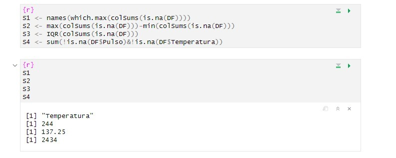

# Repaso 1

## Importar el Dataframe

```{r}
getwd() # Ruta del archivo actual
setwd("C:/Users/dfigu/OneDrive/Documents/RStudio/datasets") # Cambiamos de directorio
getwd() # Ruta nueva (carpeta de datasets, donde accederemos a nuestro archivo csv)
DF <- read.csv("L1C.csv") # Leemos el CSV
View(DF) # Mostrar el DF en pantalla
```

## Pregunta 1

```{r}
# Dataframe con las variables que tienen dos datos faltantes o menos
DF <- DF[rowSums(is.na(DF)) <= 2, ]

# Vector con las variables y su cantidad de datos faltantes
faltantesVariables <- colSums(is.na(DF))
faltantesVariables

# Rango y Cuartiles de la cantidad de datos faltantes por variable
max(faltantesVariables) - min(faltantesVariables)
quantile(faltantesVariables, 0.75) - quantile(faltantesVariables, 0.25)

# Tamaño efectivo de la muestra en la que tanto pulso como temperatura no son NA
nrow(DF[!is.na(DF$Temperatura) & !is.na(DF$Pulso), ])
sum(complete.cases(DF$Temperatura, DF$Pulso)) # Alternativa
```

The && operator is a short-circuit operator that evaluates conditions only until one condition is found to be FALSE. This operator is typically used for control flow, such as in if statements or while loops.

### Solución alternativa



## Pregunta 2

```{r}
# Función para calcular el Coeficiente de Variación
cv <- function(var) {
  return(sd(var)/mean(var))
}

library(stringr)
help(str_split_fixed)

# Separar las variables según el separador "/"
DF$Sisto <- as.integer(str_split_fixed(DF$Presion, "/", 2)[, 1])
DF$Diasto <- as.integer(str_split_fixed(DF$Presion, "/", 2)[, 2])

#Hallar medidas de tendencia central
mean(DF$Sisto, na.rm=TRUE)
sd(DF$Sisto, na.rm=TRUE)
cv(DF$Sisto[!is.na(DF$Sisto)])

mean(DF$Diasto, na.rm=TRUE)
sd(DF$Diasto, na.rm=TRUE)
cv(DF$Diasto[!is.na(DF$Diasto)])

mean(DF$Pulso, na.rm=TRUE)
sd(DF$Pulso, na.rm=TRUE)
cv(DF$Pulso[!is.na(DF$Pulso)])
```

## Pregunta 3

```{r}
# Calculamos la correlación entre Diasto y Pulso
cor(DF$Diasto, DF$Pulso, use="complete.obs")
# Tamaño efectivo para calcular la correlación
nrow(DF[!is.na(DF$Diasto) & !is.na(DF$Pulso), ])

# Correlación específica de personas de género masculino
cor(DF$Diasto[DF$Sexo == "M"], DF$Pulso[DF$Sexo == "M"], use="complete.obs")
# Tamaño efectivo (añadiendo el parametro que deben ser hombres)
nrow(DF[!is.na(DF$Diasto) & !is.na(DF$Pulso) & DF$Sexo == "M", ])
```

## Pregunta 4

```{r}
C <- c(rgb(1, 0.5, 0, 1)
  , rgb(1, 1, 0, 1)
  , rgb(0.5, 1, 0, 1)
  , rgb(1, 0.5, 0, 0.3)
  , rgb(1, 1, 0, 0.3)
  , rgb(0.5, 1, 0, 0.3)
  )
boxplot(DF$Pulso ~ DF$Actividad*DF$Sexo
  , varwidth = TRUE
  , col = C
  , notch = TRUE
  )
```

**VERDADERO**

Al menos la cuarta parte de las mujeres con actividad alta tienen pulsos menores que los valores atípicos para el pulso de hombres con actividad baja.

Dentro de cada nivel de actividad las pulsaciones de las mujeres son, en general, menores que las de los hombres.

Al menos 75 % de las pulsaciones de los hombres con actividad baja son mayores que el cuarto superior de las pulsaciones de los hombres con actividad alta. **DIFICIL DE VISUALIZAR**

En general, las pulsaciones parecen disminuir con el aumento de la actividad.

**FALSO**

**El nivel de actividad media se representa con color verde.** Al parecer la afirmación es **FALSA**

Hay mas hombres que mujeres en la tabla. **ES VERDADERO, PERO NO SE PUEDE CONCLUIR DE SOLO MIRAR EL GRÁFICO**

El mayor valor de las pulsaciones no es un valor atípico.

### Pregunta 5

```{r}
help(mosaicplot)
# Tabla de ACTIVIDAD en función de SEXO
table(DF$Sexo, factor(DF$Actividad, levels = c('Alta', 'Media', 'Baja')))
mosaicplot(table(DF$Sexo, factor(DF$Actividad, levels = c('Alta', 'Media', 'Baja'))), useNA = "ifany")
```

**VERDADERO**

En **DF**, a medida que disminuye el nivel de actividad de los pacientes aumenta la cantidad los mismos, sin importar el sexo.

Sabemos si hay valores faltantes en alguna de las dos variables involucradas.

El nivel de actividad no parece depender del sexo del paciente.

Hay más hombres con un nivel de actividad bajo que mujeres con un nivel de actividad bajo.

**FALSO**

La gráfica que se pide analizar debe usar la función table con la variable **Actividad** primero.

Hay más mujeres con un nivel de actividad medio que hombres con actividad baja.

Hay aproximadamente la misma cantidad de hombres que de mujeres en la muestra.
